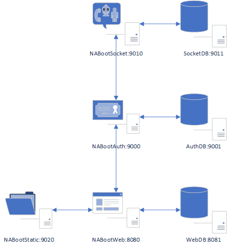

# NABootContainerization
Containerization of all systems in NA Boot Plan.

## Architecture



## Command
### Pull projects from GitHub
```bash
chmod u+x ./cloneRepositories.sh
./cloneRepositories.sh
```

### Create static folder
```bash
chmod u+x ./createStaticFolder.sh
./createStaticFolder.sh
```

### Start up projects
```bash
docker-compose up
```

#### Deamon mod
```bash
docker-compose up -d
```

### Shut down projects
```bash
docker-compose down
```

#### Shut down and clear projects
```bash
docker-compose down --rmi 'all'
```